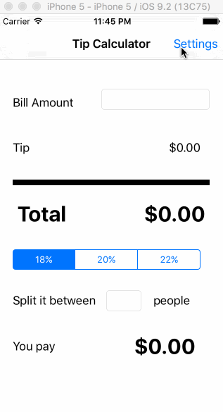

# Pre-work - *Tip Calculator*

**Splitco** is a tip calculator application for iOS.

Submitted by: **Carlos Osco Huaricapcha**

Time spent: **25** hours spent in total

## User Stories

The following **required** functionality is complete:
* [x] User can enter a bill amount, choose a tip percentage, and see the tip and total values.

The following **optional** features are implemented:
* [x] Settings page to change the default tip percentage.
* [ ] UI animations
* [ ] Remembering the bill amount across app restarts (if <10mins)
* [ ] Using locale-specific currency and currency thousands separators.
* [ ] Making sure the keyboard is always visible and the bill amount is always the first responder. This way the user doesn't have to tap anywhere to use this app. Just launch the app and start typing.
* [x] Split amount between a certain number of people

The following **additional** features are implemented:

- [ ] List anything else that you can get done to improve the app functionality!
I could also used another person that will input an $x. So, the remaining money will be splited within the rest of the party.

## Video Walkthrough 

Here's a walkthrough of implemented user stories:

GIF created with [LiceCap](http://www.cockos.com/licecap/).

## Notes

Describe any challenges encountered while building the app.

Challenges that I have faced during this assignment are:
- Lack of knowledge of xCode and Mac. However I have learned a lot throughout google and reading CodePath guidelines.
- The optionial parts were very difficult to do since there was no video tutorial, so I was on my own. I have managed to do a few of the optionials, loaded the setting page but couldn't keep the data stored as a UserDefaultsettings.'
- I am not a C.S. Major, so I have zero knowledge about coding, but so glad I built my first app.
- Github is a new interface I needed to learn. It was complicated to learn how to update(push) things to the cloud(server).

## License

    Copyright [2015] [Carlos Osco Huaricapcha]

    Licensed under the Apache License, Version 2.0 (the "License");
    you may not use this file except in compliance with the License.
    You may obtain a copy of the License at

        http://www.apache.org/licenses/LICENSE-2.0

    Unless required by applicable law or agreed to in writing, software
    distributed under the License is distributed on an "AS IS" BASIS,
    WITHOUT WARRANTIES OR CONDITIONS OF ANY KIND, either express or implied.
    See the License for the specific language governing permissions and
    limitations under the License.
